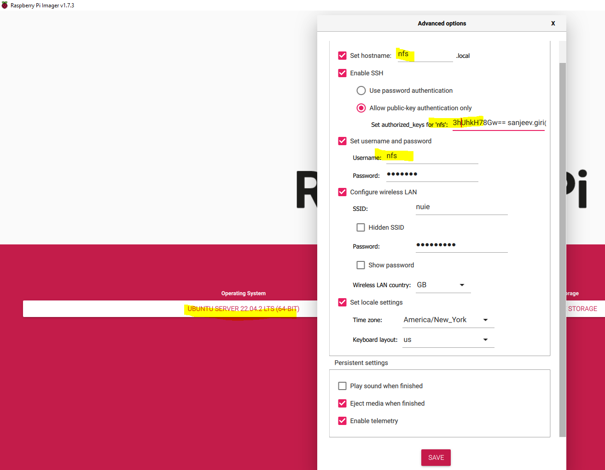

# Raspberry Pi: Kubernets Cluster with NFS for persistent volumes

## Creating an Ubuntu image using raspberrypi imager
> Install raspberry pi imager from https://www.raspberrypi.com/software/

> Creating an image using - Raspberry Pi OS Other > Raspberry Pi OS Lite (64 bit No desktop)

> Click on gear icon, and setup keypair only using username of the public key

## Imager TODO
- ssh-keygen -t rsa -f ~/.ssh/raspi_id_rsa3 -C pi
- Gear hostname bastion
- Allow public key auth only
- While creating image use pi for for the keypair user pi
